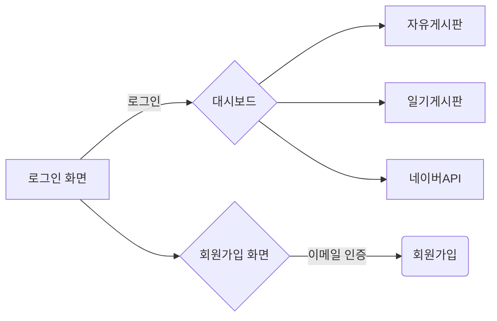

# PHC-WORLD
### 기술 스택
> * JAVA 8
> * Spring-Boot 2.x
> * Spring-Security
> * JPA
> * JWT
> * Maven, Gradle 7.6
> * h2-database, MySql, Redis
> * bootstrap
> * jQuery
> * Ajax
> * Lombok
> * mustache template
> * Junit4 테스트
***
### 사이트 기능

### ERD

### 프로젝트 소개
* 게시판을 이용할 수 있는 사이트이며 실전 경험을 통해 성능 개선 및 궁금증 해결을 위한 토이 프로젝트입니다.
* 사이트의 모든 기능은 회원만 이용 가능합니다.
* 게시판은 두 종류입니다.
  1. 회원이 이용할 수 있는 자유게시판
  2. 자신의 글만 모아놓은 일기 게시판
* 회원간에는 메세지를 주고 받을 수 있습니다.
***
### 프로젝트 주요 성과
- 빠른 대량 데이터 삽입
  - 대량의 데이터 처리에 있어 데이터 필요함 인지
  - MySQL의 ID 전략은 JPA에서 제공하는 Batch Insert 불가 확인
  - JDBC bulk insert 구현 100만건 22s
  - DBMS별 ID 전략 차이 이해
- 게시글 검색 성능 개선
  - 약 300만건의 데이터 조회 시 속도 저하 인지 6252ms
  - 커버링 인덱스 + IN 쿼리로 속도 개선 6252ms -> 641ms
- 게시물의 좋아요 카운트 기준 정렬 성능 개선
  - 약 300만건의 게시물의 좋아요 갯수 정렬 조회 속도 저하 인지 17s
  - 실행계획을 확인하며 JOIN문을 서브쿼리로 변경하여 속도 개선 17s -> 6s
  - MySQL의 정렬 속도와 JAVA의 정렬 속도 비교를 위해 Heap Sort 구현 동일 시간 확인 6s
  - 더 빠른 조회를 위해 게시물의 count 컬럼 및 인덱스 추가로 update 쿼리로 카운팅하여 정렬 6s -> 0.6s
- 게시물 해시태그 검색 조회 성능 개선
  - 다대다 테이블의 검색 조회 속도 테스트로 속도 저하 인지 7724m
  - 게시물 300만 건에 등록된 해시태그 100만개 커버링 인덱스 + 쿼리힌트로 속도 개선 7724ms -> 532ms
- 게시물의 좋아요 등록 동시성 해결
  - 사용자는 각 게시물의 좋아요 하나만 등록 가능
  - ExecutorService와 CountDownLatch를 활용하여 동시에 등록 요청한 만큼 중복 데이터가 삽입되는 것을 확인
  - synchronized를 사용하여 해결했지만 서버가 여러 대일 경우를 고려하여 다중 Unique 설정으로 해결
  - 더불어 트랜잭션과 락에 대해 학습
- JWT Refresh 토큰의 효율적인 수명 주기 관리를 위한 Redis 적용
  - JWT의 Refresh 토큰을 DB에 저장하고 로그아웃 시 삭제하면 데이터베이스 부하가 높아질 것을 우려
  - 만료 시간에 자동으로 삭제가 될 수 있도록 Redis로 Refresh 토큰 관리
***
