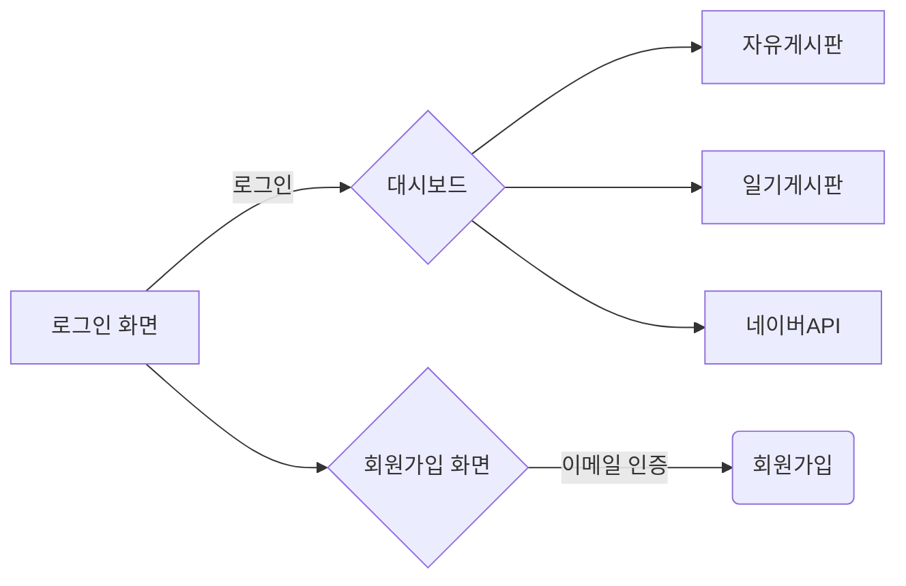

# PHC-WORLD
### 프로젝트 특징
> * JAVA 8
> * Spring-Boot
> * Spring-Security
> * JPA
> * JWT
> * Maven, Gradle
> * h2-database, MySql, Redis
> * bootstrap
> * jQuery
> * Ajax
> * Lombok
> * mustache template
> * Junit4 테스트
***
### 사이트 기능

### ERD

### 프로젝트 기능
* 게시판을 이용할 수 있는 사이트입니다.
* 사이트의 모든 기능은 회원만 이용 가능합니다.
* 게시판은 두 종류입니다.
  1. 회원이 이용할 수 있는 자유게시판
  2. 자신의 글만 모아놓은 일기 게시판
* 회원간에는 메세지를 주고 받을 수 있습니다.
* 일기 게시판은 회원 email을 주소에 타이핑하여 다른 회원의 글을 볼 수 있습니다.
* 자유게시판의 정렬은 bootstrap dataTable을 사용하였습니다.
* 일기게시판의 정렬은 Page를 사용하였습니다. 
* 로그인 후 첫페이지는 로그인 한 User의 행적(타임라인)을 최신순으로 5개를 나타냈습니다. 
* 페이지 상단에 알림 메뉴를 클릭했을 시 로그인한 User가 쓴 게시물(자유게시판, 일기게시판)에 좋아요와 댓글이 달렸을 경우 나타납니다.
* 타임라인은 자유게시판 글쓰기, 자유게시판 댓글, 일기게시판 글쓰기, 일기게시판 댓글, 일기게시판 좋아요를 보여줍니다.
***

***
### 다음에디터
* 다음에디터는 검색을 통해 파일을 다운받아 view페이지에서 사용한다.
* 다음에디터의 js파일의 양은 어마어마하다 github의 언어가 javascript로 나와서 bootstrap 을 제외시켰는데도 javascript로 나올정도여서 다음에디터도 제외시켰다.
* diary form과 freeboard form에서 각각 다른 form을 사용하기 위해 다음에디터를 처리하는 js파일도 다르다.
* 이미지 업로드는 IE10 이하에서도 가능하도록 ajaxForm 사용했다.
* daumeditor/pages/trex/image.html에 ajaxForm 추가하여 이미지 업로드 코드 추가했다.
* daumeditor/js/trex/attachment.js(다음에디터의 첨부박스)에 remove function()에 ajax로 이미지 삭제 코드 추가했다.
* 게시물 수정 요청시 본문을 가져올 때 등록된 이미지가 있으면 ajax로 파일명으로 파일정보를 가져온다.
***
